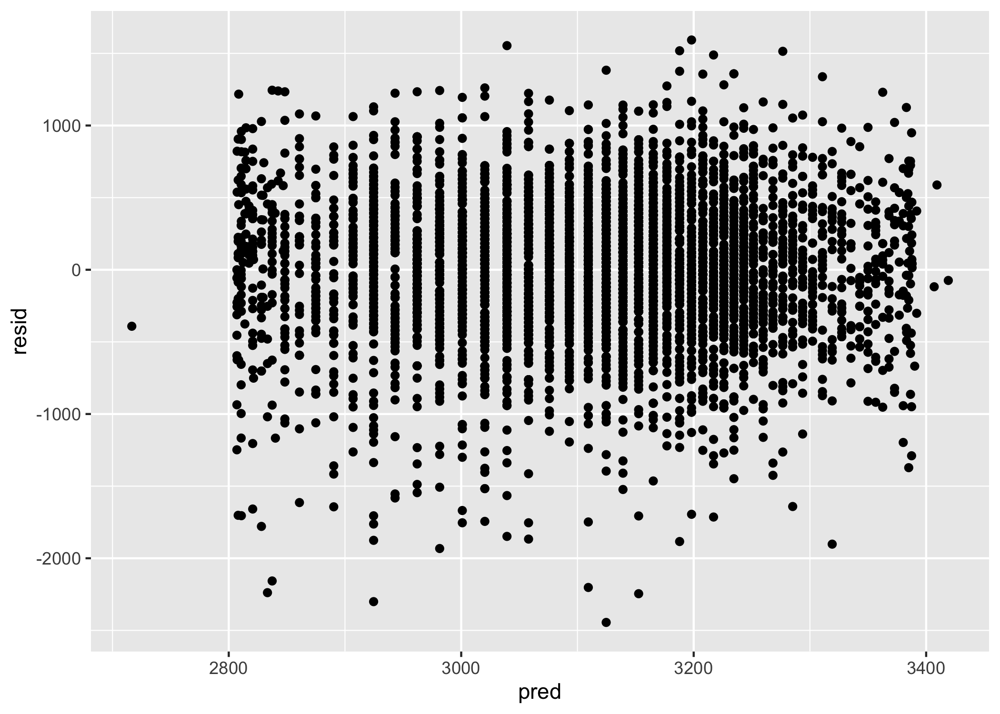
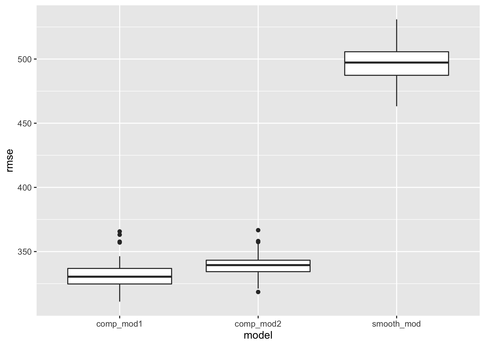

p8105_hw6_sef2183
================
Sarah Forrest
2022-11-17

# Problem 1

Download the 2017 Central Park weather data using code adapted from the
course website:

``` r
weather_df = 
  rnoaa::meteo_pull_monitors(
    c("USW00094728"),
    var = c("PRCP", "TMIN", "TMAX"), 
    date_min = "2017-01-01",
    date_max = "2017-12-31") %>%
  mutate(
    name = recode(id, USW00094728 = "CentralPark_NY"),
    tmin = tmin / 10,
    tmax = tmax / 10) %>%
  select(name, id, everything())
```

The boostrap is helpful when you’d like to perform inference for a
parameter / value / summary that doesn’t have an easy-to-write-down
distribution in the usual repeated sampling framework. We’ll focus on a
simple linear regression with tmax as the response and tmin as the
predictor, and are interested in the distribution of two quantities
estimated from these data:

r̂ 2 log(β̂ 0∗β̂ 1)

Use 5000 bootstrap samples and, for each bootstrap sample, produce
estimates of these two quantities. Plot the distribution of your
estimates, and describe these in words. Using the 5000 bootstrap
estimates, identify the 2.5% and 97.5% quantiles to provide a 95%
confidence interval for r̂ 2 and log(β̂ 0∗β̂ 1). Note: broom::glance() is
helpful for extracting r̂ 2 from a fitted regression, and broom::tidy()
(with some additional wrangling) should help in computing log(β̂ 0∗β̂ 1).

# Problem 2

The code below reads in the Washington Post’s homicide data on homicides
in 50 large U.S. cities. Then, a `city_state` variable (e.g. “Baltimore,
MD”) and a binary variable `homicide_resolved` indicating whether the
homicide is solved (“Yes” or “No”) are created. Dallas, TX, Phoenix, AZ,
and Kansas City, MO are omitted from the dataframe as these cities don’t
report victim race. Tulsa, AL is also omitted from the dataframe due to
a data entry mistake. Finally, the dataframe is limited to homicides for
whom `victim_race` is white or black and the `victim_age` variable is
converted to numeric:

``` r
homicide_df = 
  read.csv("https://raw.githubusercontent.com/washingtonpost/data-homicides/master/homicide-data.csv") %>%
  mutate(
    city_state = paste(city, state, sep = ", "),
    homicide_resolved = as.numeric(disposition == "Closed by arrest")) %>%
  filter(city_state != "Dallas, TX", 
         city_state != "Phoenix, AZ",
         city_state != "Kansas City, MO",
         city_state != "Tulsa, AL",
         victim_race == "White" | victim_race == "Black") %>%
  mutate(victim_age = as.numeric(victim_age))
## Warning in mask$eval_all_mutate(quo): NAs introduced by coercion
```

## Logistic Regression Output for Baltimore, MD

The code below uses the `glm()` function to fit a logistic regression
with resolved vs. unresolved as the outcome and victim age, sex and race
as predictors for the city of Baltimore, MD. The output of this
regression saved as an R object called `fit_logistic`.

``` r
fit_logistic =
  homicide_df %>%
  filter(city_state == "Baltimore, MD") %>%
  glm(homicide_resolved ~ victim_age + victim_sex + victim_race, data = ., family = binomial())
```

The code below obtains the estimate and confidence interval of the
adjusted odds ratio for solving homicides comparing male victims to
female victims keeping all other variables fixed:

``` r
fit_logistic %>%
  broom::tidy() %>%
  mutate(
    OR = exp(estimate),
    CI_lower = exp(estimate - (1.96 * std.error)),
    CI_upper = exp(estimate + (1.96 * std.error))) %>%
  select(term, OR, CI_lower, CI_upper) %>% 
  filter(term == "victim_sexMale") %>% 
  knitr::kable(digits = 2)
```

| term           |   OR | CI_lower | CI_upper |
|:---------------|-----:|---------:|---------:|
| victim_sexMale | 0.43 |     0.32 |     0.56 |

## Logistic Regression Output for All Cities

The code below creates a nested dataframe `homicide_nest_df` that
contains data on whether each homicide is resolved, as well as victim
demographic information for each city in the dataset. Then, a function
called “glm_OR_CI” is created that takes in a dataframe and applies the
`glm()` function to run a logistic regression model with resolved vs
unresolved as the outcome and victim age, sex and race as predictors and
calculate the estimate and confidence interval of the adjusted odds
ratio for solving homicides comparing male victims to female victims
keeping all other variables fixed. This function is called and mapped to
a new `glm_output` variable which is then unnested and assigned to a new
`homicide_glm_df` dataframe. The `homicide_glm_df` dataframe contains 5
variables: `city_state`, a `data` variable containing a tibble with the
victim and homicide data used in the logistic regression model, `OR`,
and the lower and upper confidence interval values `CI_lower` and
`CI_upper`:

``` r
homicide_nest_df = 
  homicide_df %>% 
  select(city_state, homicide_resolved, victim_race:victim_sex) %>%
  group_by(city_state) %>%
  nest(data = homicide_resolved:victim_sex)
  

glm_OR_CI = function(df) {
  
  fit_logistic = 
    glm(homicide_resolved ~ victim_age + victim_sex + victim_race, data = df, family = binomial())
  
  fit_logistic %>%
  broom::tidy() %>%
  mutate(
    OR = exp(estimate),
    CI_lower = exp(estimate - (1.96 * std.error)),
    CI_upper = exp(estimate + (1.96 * std.error))) %>%
  filter(term == "victim_sexMale") %>% 
  select(OR, CI_lower, CI_upper) 
  
}


homicide_nest_df %>% 
  mutate(glm_output = map(data, glm_OR_CI)) %>% 
  unnest(glm_output) -> homicide_glm_df

homicide_glm_df
## # A tibble: 47 × 5
## # Groups:   city_state [47]
##    city_state      data                    OR CI_lower CI_upper
##    <chr>           <list>               <dbl>    <dbl>    <dbl>
##  1 Albuquerque, NM <tibble [178 × 4]>   1.77     0.831    3.76 
##  2 Atlanta, GA     <tibble [945 × 4]>   1.00     0.684    1.46 
##  3 Baltimore, MD   <tibble [2,753 × 4]> 0.426    0.325    0.558
##  4 Baton Rouge, LA <tibble [410 × 4]>   0.381    0.209    0.695
##  5 Birmingham, AL  <tibble [771 × 4]>   0.870    0.574    1.32 
##  6 Boston, MA      <tibble [492 × 4]>   0.674    0.356    1.28 
##  7 Buffalo, NY     <tibble [479 × 4]>   0.521    0.290    0.935
##  8 Charlotte, NC   <tibble [584 × 4]>   0.884    0.557    1.40 
##  9 Chicago, IL     <tibble [4,507 × 4]> 0.410    0.336    0.501
## 10 Cincinnati, OH  <tibble [679 × 4]>   0.400    0.236    0.677
## # … with 37 more rows
```

## Plot

The code below creates a plot that shows the estimated ORs and CIs for
each city. Cities are organized according to estimated OR:

``` r
homicide_glm_df %>%
  ggplot(aes(x = reorder(city_state, OR), y = OR)) +
  geom_point() +
  geom_errorbar(aes(ymin = CI_lower, ymax = CI_upper), width = 0.2) + 
  theme(axis.text.x = element_text(angle = 90, hjust = 1)) +
  labs(
    title = "Adjusted OR for Solving Homicides Comparing Male to Female Victims",
    x = "City",
    y = "Adjusted OR Estimate")
```

<!-- -->

The city with the smallest adjusted OR estimate for solving homicides
comparing male victims to female victims is New York, NY. The confidence
interval range for this estimate is fairly small, ranging from about
0.14 to 0.50. The city with the largest adjusted OR estimate is
Albuquerque, NM. The confidence interval range for Albuquerque’s OR
estimate is much larger than New York, ranging from about 0.83 to 3.76.
A general trend that can observed from the plot is that the confidence
interval is wider as the estimated adjusted OR estimate increases.

# Problem 3

Weight gain during pregnancy (WGP), smoking, pre-pregnancy BMI,
gestational diabetes, hypertension, parity, marital status, age, and sex
of the child

wtgain + smoken + ppbmi + parity + gaweeks + babysex

gaweeks + momage + parity + ppbmi + blength + smoken

babysex: baby’s sex (male = 1, female = 2) bhead: baby’s head
circumference at birth (centimeters) blength: baby’s length at birth
(centimeteres) bwt: baby’s birth weight (grams) delwt: mother’s weight
at delivery (pounds) fincome: family monthly income (in hundreds,
rounded) frace: father’s race (1 = White, 2 = Black, 3 = Asian, 4 =
Puerto Rican, 8 = Other, 9 = Unknown) gaweeks: gestational age in weeks
malform: presence of malformations that could affect weight (0 = absent,
1 = present) menarche: mother’s age at menarche (years) mheigth:
mother’s height (inches) momage: mother’s age at delivery (years) mrace:
mother’s race (1 = White, 2 = Black, 3 = Asian, 4 = Puerto Rican, 8 =
Other) parity: number of live births prior to this pregnancy pnumlbw:
previous number of low birth weight babies pnumgsa: number of prior
small for gestational age babies ppbmi: mother’s pre-pregnancy BMI ppwt:
mother’s pre-pregnancy weight (pounds) smoken: average number of
cigarettes smoked per day during pregnancy wtgain: mother’s weight gain
during pregnancy (pounds)

Read in the “birthweight” dataset consisting of several variables of
data on roughly 4000 children:

``` r
birthweight_df = read.csv("data/birthweight.csv")
```

## Create Model

The code below produces a regression model for predictors of
birthweight. The model includes birthweight as the outcome, and
predictors of birthweight identified by Johansson et al., including:
mother’s weight gain during pregnancy, average number of cigarettes
smoked per day during pregnancy, mother’s pre-pregnancy BMI, number of
live births prior to this pregnancy (parity), mother’s age at delivery,
and baby’s sex:

Reference: Johansson K, Linné Y, Rössner S, Neovius M. Maternal
predictors of birthweight: The importance of weight gain during
pregnancy. Obes Res Clin Pract. 2007 Dec;1(4):223-90. doi:
10.1016/j.orcp.2007.09.001. PMID: 24351583.

``` r
smooth_mod = mgcv::gam(bwt ~ s(wtgain + smoken + ppbmi + parity + momage + babysex), data = birthweight_df)
## Warning in term[i] <- attr(terms(reformulate(term[i])), "term.labels"): number
## of items to replace is not a multiple of replacement length
```

The code below produces a plot of model residuals against fitted values
using `add_predictions()` and `add_residuals()`:

``` r
birthweight_df %>% 
  add_predictions(smooth_mod) %>% 
  add_residuals(smooth_mod) %>% 
  ggplot(aes(x = pred, y = resid)) + 
  geom_point() 
```

<!-- -->

## Compare Model

Comparison model 1: the code below produces a regression model for
birthweight using length at birth and gestational age as predictors
(main effects only):

``` r
comp_mod1 = mgcv::gam(bwt ~ s(blength + sgaweeks), data = birthweight_df)
## Warning in term[i] <- attr(terms(reformulate(term[i])), "term.labels"): number
## of items to replace is not a multiple of replacement length
```

Comparison model 2: the code below produces a regression model for
birthweight using head circumference, length, sex, and all interactions
(including the three-way interaction) between these:

``` r
comp_mod2 = mgcv::gam(bwt ~ s(bhead + blength + babysex + bhead*blength + bhead*babysex + blength*babysex + bhead*blength*babysex), data = birthweight_df)
## Warning in term[i] <- attr(terms(reformulate(term[i])), "term.labels"): number
## of items to replace is not a multiple of replacement length
```

The code below compares models in terms of the cross-validated
prediction error using `crossv_mc()` and `map()`. A boxplot for each
model is created to compare the root-mean-square error (RMSE) values for
each model:

``` r
cv_df = 
  crossv_mc(birthweight_df, 100) %>% 
  mutate(
    train = map(train, as_tibble),
    test = map(test, as_tibble)) %>% 
  mutate(
    smooth_mod = map(.x = train, ~mgcv::gam(bwt ~ s(wtgain + smoken + ppbmi + parity + momage + babysex), data = as_tibble(.x))),
    comp_mod1 = map(.x = train, ~mgcv::gam(bwt ~ s(blength + sgaweeks), data = as_tibble(.x))),
    comp_mod2 = map(.x = train, ~mgcv::gam(bwt ~ s(bhead + blength + babysex + bhead*blength + bhead*babysex + blength*babysex + bhead*blength*babysex), data = as_tibble(.x)))) %>% 
  mutate(
    rmse_smooth_mod = map2_dbl(.x = smooth_mod, .y = test, ~rmse(model = .x, data = .y)),
    rmse_comp_mod1 = map2_dbl(.x = comp_mod1, .y = test, ~rmse(model = .x, data = .y)),
    rmse_comp_mod2 = map2_dbl(.x = comp_mod2, .y = test, ~rmse(model = .x, data = .y)))

cv_df
## # A tibble: 100 × 9
##    train    test     .id   smooth_mod comp_mod1 comp_m…¹ rmse_…² rmse_…³ rmse_…⁴
##    <list>   <list>   <chr> <list>     <list>    <list>     <dbl>   <dbl>   <dbl>
##  1 <tibble> <tibble> 001   <gam>      <gam>     <gam>       510.    366.    337.
##  2 <tibble> <tibble> 002   <gam>      <gam>     <gam>       507.    331.    334.
##  3 <tibble> <tibble> 003   <gam>      <gam>     <gam>       483.    311.    334.
##  4 <tibble> <tibble> 004   <gam>      <gam>     <gam>       502.    346.    367.
##  5 <tibble> <tibble> 005   <gam>      <gam>     <gam>       514.    341.    342.
##  6 <tibble> <tibble> 006   <gam>      <gam>     <gam>       488.    320.    336.
##  7 <tibble> <tibble> 007   <gam>      <gam>     <gam>       479.    357.    336.
##  8 <tibble> <tibble> 008   <gam>      <gam>     <gam>       492.    328.    339.
##  9 <tibble> <tibble> 009   <gam>      <gam>     <gam>       508.    329.    346.
## 10 <tibble> <tibble> 010   <gam>      <gam>     <gam>       465.    318.    331.
## # … with 90 more rows, and abbreviated variable names ¹​comp_mod2,
## #   ²​rmse_smooth_mod, ³​rmse_comp_mod1, ⁴​rmse_comp_mod2

cv_df %>% 
  select(starts_with("rmse")) %>% 
  pivot_longer(
    everything(),
    names_to = "model",
    values_to = "rmse",
    names_prefix = "rmse_"
  ) %>% 
  ggplot(aes(x = model, y = rmse)) +
  geom_boxplot()
```

<!-- -->

The model with the lowest RMSE id \_\_\_\_\_.
